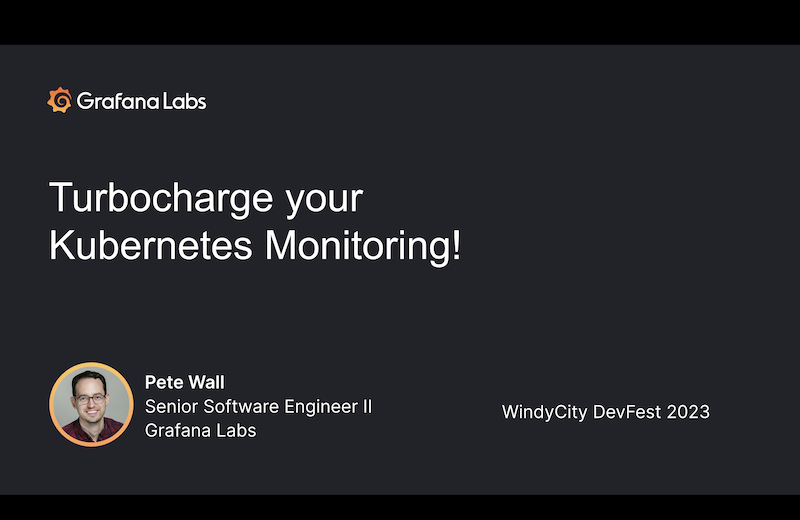

# WindyCity DevFest 2023

Thank you for your interest in my talk at [WindyCity DevFest 2023](https://windycity.devfest.io/)!

This repo has the source for the demo that I gave.

## Slides

Click the image for the slides

## Resources used:

* [Kubernetes Monitoring Helm chart](https://github.com/grafana/k8s-monitoring-helm) - The Helm chart that deploys, in one step, the monitoring system to capture cluster infrastructure metrics and logs, and send them to a back-end of your choice.
* [Grafana Cloud](https://grafana.com/products/cloud/) - I used a free-tier organization for the live demo.
* [Prometheus Helm chart](https://github.com/prometheus-community/helm-charts/tree/main/charts/prometheus) - Provides metric storage.
* [Grafana Loki Helm chart](https://github.com/grafana/loki/tree/main/production/helm/loki) - Provides log storage.
* [Grafana Tempo Helm chart](https://github.com/grafana/helm-charts/tree/main/charts/tempo) - Provides trace storage.

## Setting up the environment

### Set up cluser
`make create-cluster`
`rm kubeconfig.yaml; make kubeconfig.yaml`

### Deploy applications
`kubectl apply -f deployments`

### Deploy telemetry data storage
`helm install prometheus prometheus-community/prometheus -f configs/prometheus.yaml -n monitoring`
`helm install loki grafana/loki -f configs/loki.yaml -n monitoring`
`helm install tempo grafana/tempo -n monitoring`

### Deploy Kubernetes Monitoring
`helm install kubernetes-monitoring grafana/k8s-monitoring --version 0.2.12 -f configs/kubernetes-monitoring.yaml -n monitoring --wait`

### Deploy Grafana
`helm install grafana grafana/grafana -f configs/grafana.yaml -n monitoring --wait`

### Take a look!
Launch k9s and port forward grafana
`./scripts/grafana-creds.sh | pbcopy`
Open [Grafana](http://localhost:3000)
